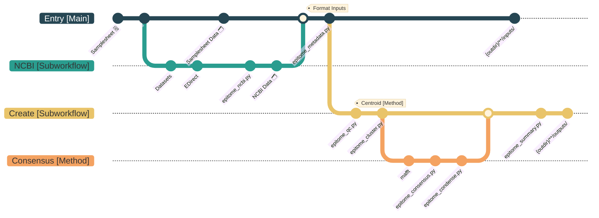

# EPITOME: Enhanced Phylogenetic Inference Through Optimized Mapping Efficiency

EPITOME condenses a diverse set of DNA sequences into discrete, composite sequences that represent the overarching diversity of the dataset. In other words, EPITOME creates sequences that are the _epitome_ of the dataset diversity. This is accomplished by clustering the input based on pairwise genetic distances and then selecting the most common nucleotide at each genomic position (ties selected at random) and / or by selecting the centroid of each cluster. When the genetic distance is based on read mapping efficiency, EPITOME creates a set of reference genomes for consensus-based assembly pipelines, like [VAPER](https://github.com/DOH-JDJ0303/VAPER).

See the [wiki](https://github.com/DOH-JDJ0303/epitome/wiki) for more information.

# Pipeline Overview


# Quick Start
## Step 1. Create your samplesheet
> [!NOTE]
> The example below creates a reference set for each taxon using data automatically downloaded from NCBI. It is also possible to supply your own sequence data with or without the NCBI data - learn more [here](https://doh-jdj0303.github.io/epitome-docs/).

`samplesheet.csv`:
```
taxon,segmented
Hantavirus,true
Norovirus,false
```
## Step 2. Run EPITOME
Run EPITOME using the command below.
```
nextflow run DOH-JDJ0303/epitome \
    -r main \
    -profile docker \
    --input samplesheet.csv \
    --outdir results
```


